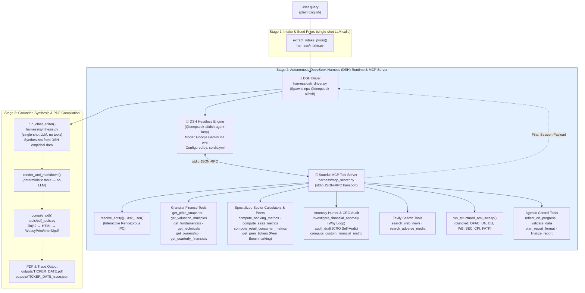

# Architecture

## System Overview

The Agentic Financial Report Generator takes a plain-English request (e.g. *"full equity report on TCS with AML screening"*), extracts initial classification priors, executes an autonomous **DeepSeek Harness (DSH)** agentic orchestrator session connected to a local **Model Context Protocol (MCP)** tool server over stdio, dynamically gathers market metrics, live news, and AML compliance findings, formats the report via a structured `ReportSpec`, and renders it into a publication-ready PDF.

### Key Architectural Tenets
1. **Deterministic Numbers**: No LLM ever invents or computes financial metrics or sanctions statuses. Numbers originate strictly from deterministic Python tools exposed via MCP (`harness/mcp_server.py`, `tools/finance_tools.py`, `tools/aml_tools.py`, `tools/peer_resolver.py`).
2. **DeepSeek Harness (DSH) Autonomous Agent Runtime**: DSH's own ReAct loop (`Perceive → Reason → Act → Observe`) decides which tools to call, when to search again, when data is sufficient, how to structure the report, and when to stop.
3. **Stateful MCP Tool Server**: `harness/mcp_server.py` exposes all 22 tools (data, sector calculators, peer benchmarking, anomaly hunting, CRO audit, search, AML, calculation sandbox, `validate_data`, `plan_report_format`, `reflect_on_progress`, `ask_user`, and `finalize_report`) and maintains the run's session state.
4. **Single Human Interaction Point (Rendezvous IPC)**: When `resolve_entity` returns multiple candidates, DSH calls `ask_user`. The MCP server writes a pending IPC descriptor, the driver prompts the terminal interactively, and the user's choice is returned to DSH over stdio.
5. **Single Source of Truth**: Stage 3 (Chief Editor synthesis) reads solely the empirical data gathered by DSH during its session from `final_session.json` — zero parallel data re-fetching in Python.

---

### Pipeline Diagram

---

## File-by-File Map

### Entry Point & Config

| File | What it does | Layer/Stage |
|---|---|---|
| `main.py` | CLI entry point; runs intake prior, invokes DSH Driver, compiles PDF | Pipeline |
| `config.py` | `pydantic-settings` config — reads `.env`; validates API keys and DSH runtime settings | Config |
| `cordis.yml` | Cordis plugin composition configuring DSH headless runtime, Gemini provider, and MCP tools | Config |
| `schemas.py` | All Pydantic data models (`AgentState`, `ReportSpec`, `MarketMetrics`, `ToolCallRecord`, etc.) | Shared |
| `orchestrator_config.yaml` | Per-report-type data requirement profiles for `validate_data()` | Config |
| `render_config.yaml` | Default section ordering fallback | Config |

### Harness (Autonomous Runtime & Synthesis)

| File | What it does | Layer/Stage |
|---|---|---|
| `harness/dsh_driver.py` | Spawns DSH headless runner, handles ask_user IPC, loads session state, triggers synthesis | Stage 2 Driver |
| `harness/dsh_orchestrator.py` | Forwarder module re-exporting `run_dsh_orchestrator` to `harness.dsh_driver` | Stage 2 Forwarder |
| `harness/mcp_server.py` | Stateful Model Context Protocol (MCP) server managing all 24 agentic tools over stdio | Stage 2 MCP Server |
| `harness/intake.py` | Single-shot LLM calls: seed company reference + seed report type prior | Stage 1 |
| `harness/synthesis.py` | Chief Editor (single-shot LLM → Markdown with `ReportSpec` overrides); `render_aml_markdown()` deterministic table | Stage 3 |
| `harness/gemini_retry.py` | 429-aware retry wrapper for `generate_content` with backoff | Shared |
| `harness/md_loader.py` | Parses YAML-frontmatter `.md` prompt files (e.g. `agents/chief_editor.md`) | Shared |

### Tools (Data Fetching, Sector Logic, Verification, Output)

| File | What it does | Layer/Stage |
|---|---|---|
| `tools/finance_tools.py` | Granular yfinance fetchers, sector calculators (banking/SaaS/retail), AST sandbox, CRO audit engine | Data & Calculators |
| `tools/scraper_tools.py` | Universal web scraper + specialized Moneycontrol portal scraper with caching & Playwright fallback | Scraping Tools |
| `tools/peer_resolver.py` | Peer discovery & competitor comparative valuation multiples resolver | Data Tools |
| `tools/ticker_resolver.py` | Conglomerate map + static map + yfinance search → multi-candidate resolution with fail-closed fallback | Data Tools |
| `tools/conglomerate_map.yaml` | Curated group mappings (Tata, Reliance, Adani, Mahindra, Bajaj, Birla, HDFC, ICICI) | Data Tools |
| `tools/aml_tools.py` | Bundled structured AML sweep + focused adverse media search | Compliance Tools |
| `tools/search_tools.py` | Tavily web search wrapper + targeted anomaly investigation ("The Why Loop") | Search Tools |
| `tools/pdf_tools.py` | Markdown → HTML (Jinja2) → PDF (WeasyPrint / xhtml2pdf fallback) | Output |
| `tools/chart_tools.py` | Matplotlib price + MA chart → base64 PNG data URI | Output |
| `tools/health_check.py` | System health check verifying API keys, PDF engines, dirs & endpoints | Utility |
