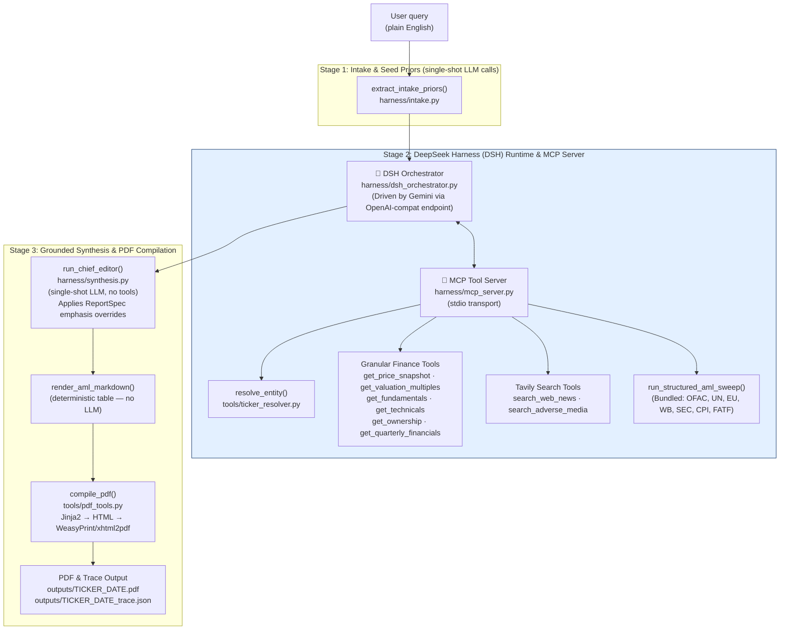

# Architecture

## System Overview

The Agentic Financial Report Generator takes a plain-English request (e.g. *"full equity report on TCS with AML screening"*), extracts initial classification priors, executes a **DeepSeek Harness (DSH)** agentic orchestrator session connected to a local **Model Context Protocol (MCP)** tool server, dynamically gathers market metrics, live news, and AML compliance findings, formats the report via a structured `ReportSpec`, and renders it into a publication-ready PDF.

### Key Architectural Tenets
1. **Deterministic Numbers**: No LLM ever invents or computes financial metrics or sanctions statuses. Numbers originate strictly from deterministic Python tools exposed via MCP (`harness/mcp_server.py`, `tools/finance_tools.py`, `tools/aml_tools.py`).
2. **DeepSeek Harness (DSH) Agent Runtime**: Leverages DSH plugin architecture and stdio JSON-RPC protocol with Gemini via its OpenAI-compatible endpoint.
3. **MCP Tool Server**: Exposes granular finance, compliance, and search tools as standardized Model Context Protocol tools.
4. **Single Human Interaction Point**: The loop pauses only when `resolve_entity` returns multiple candidate entities (e.g. "Tata" conglomerate disambiguation via `ask_user`).
5. **Dynamic Report Framing**: `ReportSpec` directs the Chief Editor on section inclusion, order, and emphasis based on empirical findings.

### Pipeline Diagram



---

## File-by-File Map

### Entry point

| File | What it does | Layer/Stage |
|---|---|---|
| `main.py` | CLI entry point; runs intake prior, invokes DSH Orchestrator, compiles PDF | Pipeline |
| `config.py` | `pydantic-settings` config — reads `.env`; validates API keys and DSH runtime settings | Config |
| `cordis.yml` | Cordis plugin composition configuring DSH JSON-RPC server and MCP tool server | Config |
| `schemas.py` | All Pydantic data models (`AgentState`, `ReportSpec`, `MarketMetrics`, etc.) | Shared |
| `render_config.yaml` | Default section ordering fallback | Config |

### Harness (pipeline logic)

| File | What it does | Layer/Stage |
|---|---|---|
| `harness/dsh_orchestrator.py` | DSH agent session orchestrator, MCP tool dispatch, telemetry, state aggregation | Stage 2 |
| `harness/mcp_server.py` | Model Context Protocol (MCP) tool server exposing finance, AML, and search tools | Stage 2 |
| `harness/intake.py` | Single-shot LLM calls: seed company reference + seed report type prior | Stage 1 |
| `harness/synthesis.py` | Chief Editor (single-shot LLM → Markdown with `ReportSpec` overrides); `render_aml_markdown()` deterministic table | Stage 3 |
| `harness/gemini_retry.py` | 429-aware retry wrapper for `generate_content` with backoff | Shared |
| `harness/md_loader.py` | Parses YAML-frontmatter `.md` files into agent system prompts | Shared |

### Tools (data fetching and output)

| File | What it does | Layer/Stage |
|---|---|---|
| `tools/finance_tools.py` | Granular yfinance fetchers: price snapshot, valuation, fundamentals, quarterly, technicals, holdings | Data Tools |
| `tools/ticker_resolver.py` | Conglomerate map + static map + yfinance search → multi-candidate resolution with fail-closed fallback | Data Tools |
| `tools/conglomerate_map.yaml` | Curated group mappings (Tata, Reliance, Adani, Mahindra, Bajaj, Birla, HDFC, ICICI) | Data Tools |
| `tools/aml_tools.py` | Bundled structured AML sweep + focused adverse media search | Compliance Tools |
| `tools/search_tools.py` | Tavily web search wrapper with shared budget tracking | Search Tools |
| `tools/pdf_tools.py` | Markdown → HTML (Jinja2) → PDF (WeasyPrint / xhtml2pdf fallback) | Output |
| `tools/chart_tools.py` | Matplotlib price + MA chart → base64 PNG data URI | Output |

### Agent prompts (`agents/`)

| File | What it does |
|---|---|
| `agents/orchestrator.md` | System instruction for the Master Orchestrator |
| `agents/chief_editor.md` | System instruction for the Chief Editor synthesis call |

### Runtime Skills (`skills/`)

| File | What it does |
|---|---|
| `skills/resolve_entity.md` | Schema for `resolve_entity` |
| `skills/ask_user.md` | Schema for `ask_user` (the only pause) |
| `skills/get_price_snapshot.md` | Schema for `get_price_snapshot` |
| `skills/get_valuation_multiples.md` | Schema for `get_valuation_multiples` |
| `skills/get_fundamentals.md` | Schema for `get_fundamentals` |
| `skills/get_quarterly_financials.md` | Schema for `get_quarterly_financials` |
| `skills/get_technicals.md` | Schema for `get_technicals` |
| `skills/get_ownership.md` | Schema for `get_ownership` |
| `skills/search_web_news.md` | Schema for `search_web_news` |
| `skills/run_structured_aml_sweep.md` | Schema for `run_structured_aml_sweep` |
| `skills/search_adverse_media.md` | Schema for `search_adverse_media` |
| `skills/validate_data.md` | Schema for `validate_data` |
| `skills/plan_report_format.md` | Schema for `plan_report_format` |
| `skills/finalize_report.md` | Schema for `finalize_report` |


### Antigravity IDE skills (`.agents/skills/`) — human/IDE-facing documentation

| File | What it does |
|---|---|
| `.agents/skills/pdf-report-generator/SKILL.md` | How the rendering pipeline works; how to add/reorder sections; template variable reference |
| `.agents/skills/aml-abc-screening/SKILL.md` | AML/ABC pipeline; data source table; severity classification; known gaps; how to add a source |

### Templates and static assets

| File | What it does |
|---|---|
| `templates/report_template.html` | Jinja2 HTML shell: header, chart slot, body, Layer 1 disclaimer, Layer 2 AML disclaimer |
| `static/report.css` | Print-oriented A4 stylesheet (inlined at render time) |

### Utilities

| File | What it does |
|---|---|
| `utils/retry.py` | Exponential-backoff retry decorator (tenacity) for yfinance and Tavily calls |

---

## Plain-English Explainer: Agentic Concepts in This Codebase

### What is a "skill"?

In this project, the word "skill" is used in two distinct ways — don't confuse them:

**Runtime skills (`skills/*.md`)** — machine-read by the Python code. Each file has a YAML block at the top (the "frontmatter") that describes a tool the Gemini model can call: what the function is called, what arguments it takes, and which Python function to actually run. Below the YAML block is prose for humans. When `harness/md_loader.py` loads a skill, it reads the YAML to build a `FunctionDeclaration` (the Gemini API's way of describing a tool) and resolves the Python callable. The model can then ask to call that tool by name, and the harness runs the real function and feeds the result back into the conversation.

**IDE skills (`.agents/skills/*/SKILL.md`)** — documentation for developers and the Antigravity IDE. These are not read by the Python runtime. They describe how subsystems work, when to activate the skill, and how to extend the system. They follow the Antigravity workspace customization convention: the IDE discovers them when you're working in this project directory and can load them as context when you ask questions about the codebase.

The YAML frontmatter pattern is the same in both cases — that's intentional — but the runtime and the IDE read *different directories*. `skills/` is the runtime directory; `.agents/skills/` is the IDE documentation directory.

**Why is this better than a hardcoded template?** Before this refactor, section ordering was hardcoded strings inside `harness/synthesis.py`. To add a section, you'd edit Python source. Now, `render_config.yaml` lists what sections appear in what order per report type, and `synthesis.py` reads that config at startup. Adding a section is a YAML edit plus a Python function — not a search through a file of nested f-strings.

### What is the "harness"?

The harness is the scaffolding that runs the pipeline: `harness/agent_loop.py`, `harness/synthesis.py`, `harness/intake.py`, and `harness/md_loader.py`. It is not a product you modify to change the report's content — it is the plumbing that connects LLM calls, tool invocations, and data transformations.

When someone says "the harness," they mean the shared execution layer that:
- Manages the conversation `contents` list (the chat history the model reads)
- Routes tool calls to real Python functions and feeds results back
- Enforces the turn budget so the model can't loop indefinitely
- Validates outputs against Pydantic schemas before passing them downstream

You don't modify the harness to change what the report contains — you modify the agent prompts (`agents/*.md`), the section config (`render_config.yaml`), or the data fetchers (`tools/`).

### What is the "Agent Manager / tool-approval flow"?

When you run this project inside the Antigravity IDE (rather than from the terminal directly), the IDE's Agent Manager intercepts tool calls and may ask for your approval before running them. This applies to any tool the model calls — `search_web_news`, `screen_entity_aml`, etc.

For this project:
- `search_web_news` makes live web requests (Tavily) — the IDE will show you the query before running it.
- `screen_entity_aml` does the same.
- All `tools/finance_tools.py` and `tools/aml_tools.py` calls are **not** exposed as Gemini tools — they are plain Python functions called directly. The Agent Manager doesn't intercept them.

If you're running from the terminal (`python main.py ...`), there is no approval gate — all tool calls execute automatically within the turn budget.

---

## How to Run and Test Locally

### Prerequisites
```bash
python -m venv venv
venv\Scripts\activate        # Windows
# source venv/bin/activate   # Linux/macOS

pip install -r requirements.txt
```

Verify your `.env` has valid `GEMINI_API_KEY` and `TAVILY_API_KEY`.

### Run Layer 1 only (standard report)
```bash
python main.py "full equity report on TCS"
python main.py "news sentiment report of Reliance Industries"
python main.py "valuation analysis of Apple"
```
Output PDF: `outputs/TCS_NS_YYYY-MM-DD.pdf`

### Run Layer 1 + Layer 2 (with AML screening)
```bash
python main.py "full equity report on TCS" --aml
```
The `--aml` flag adds ~30–60 seconds of external API calls. The PDF will include the AML/ABC Compliance Screening section and an amber-bordered compliance disclaimer.

### Verify Layer 1 independently
Check the PDF for:
- Financial Highlights table (price, market cap, 50d/200d MA, period high/low)
- Fundamentals Deep-Dive (EPS, D/E, ROE, ROCE, analyst consensus, quarterly financials)
- Technical Analysis (RSI-14, MACD, volume trend, support/resistance)
- Ownership & Holdings (insider %, institutional %)
- Risk Factors (cited, not generic)
- Scenario Outlook (Bull / Base / Bear)

Any field yfinance couldn't supply will say "data unavailable" — not a guessed value.

### Verify Layer 2 independently
Check the AML section in the PDF for:
- A screening table with all 6+ structured sources listed per entity
- Severity icons (🟢 None / 🟡 Watch / 🟠 Elevated / 🔴 High)
- The amber-bordered compliance disclaimer at the bottom
- At minimum one "No match found" row per source (this is the expected result for most clean companies)

### Test with unavailable data (expected behavior)
Run against a small-cap or obscure ticker — many fields will be unavailable. Verify the report says "data unavailable" rather than fabricating a number.

---

## Known Limitations & TODOs

### Data source gaps

| Gap | Reason | Status |
|---|---|---|
| MCA/ROC India filings (director data) | No machine-readable free API | Documented; Tavily search used as fallback |
| RBI Wilful Defaulter list | No central machine-readable index | Documented; manual review recommended |
| ICIJ Offshore Leaks database | Large dataset requiring local indexing | Future enhancement |
| NSE/BSE individual FII/DII breakdown | Requires exchange filing API access | Yahoo Finance combined institutional % only |
| YoY quarterly growth (4-quarter window limit) | yfinance default returns 4 columns; year-ago comparison requires wider fetch | Future: fetch 8 quarters for proper YoY |
| Promoter/director name extraction | No structured free API for Indian company boards | Entities screened are company name + ticker only |
| FATF / TI CPI snapshots | Hardcoded; require manual update when FATF publishes new plenary list | Manual update (FATF: tri-annual; TI CPI: annual) |

### Peer comparison
Explicitly not built. The codebase focuses on the company in question, not sector comparisons. Adding peer comparison would require a peer-discovery mechanism (yfinance has no native API for this) and is a meaningful feature in its own right.

### Report type detection
The intake classifier (`harness/intake.py`) is a single-shot LLM call. It works well for clear queries but may misclassify ambiguous ones (e.g. "what about TCS stock" → GENERAL rather than EQUITY). The fallback is always GENERAL, which is safe but less specific.

---

## How to Extend the System

### Add a new data field to Layer 1
1. Add the field to `schemas.py:MarketMetrics` (with `Optional[...]` and a docstring).
2. Fetch it in `tools/finance_tools.py` — add to `_INFO_FIELDS` if it's a yfinance `.info` key, or compute it from the history series.
3. Add it to `unavailable_fields` if the fetch fails.
4. Write a Chief Editor instruction for it in `harness/synthesis.py` (update the relevant `_instr_*` function).

### Add a new report section
1. Edit `render_config.yaml` — add the section key to the appropriate `layer1_sections` list.
2. Add a heading to `_SECTION_HEADINGS` in `harness/synthesis.py`.
3. Add an instruction builder to `_SECTION_INSTRUCTION_MAP` in `harness/synthesis.py`.

### Add a new AML screening source
Follow the pattern in `.agents/skills/aml-abc-screening/SKILL.md` — implement a function in `tools/aml_tools.py`, add it to `run_structured_aml_sweep` in `tools/aml_tools.py`.

### Add a Layer 3
Follow the layering pattern:
1. New tools module (`tools/layer3_tools.py`)
2. New agent loop (`harness/layer3_agent.py`) mirroring `harness/aml_agent.py`
3. New agent prompt (`agents/layer3_agent.md`)
4. New skill spec (`skills/layer3_tool.md`) if the agent needs a Gemini-callable tool
5. New IDE skill doc (`.agents/skills/layer3/SKILL.md`)
6. New section key in `render_config.yaml`
7. New Markdown renderer in `harness/synthesis.py` (following `render_aml_markdown`)
8. New CLI flag in `main.py` following the `--aml` pattern

### Change section ordering
Edit only `render_config.yaml`. No code changes needed.

### Change the model
Set `GEMINI_MODEL` in `.env`. The model name flows through `config.py:Settings.gemini_model` into every `generate_with_retry` call. No code changes needed.
